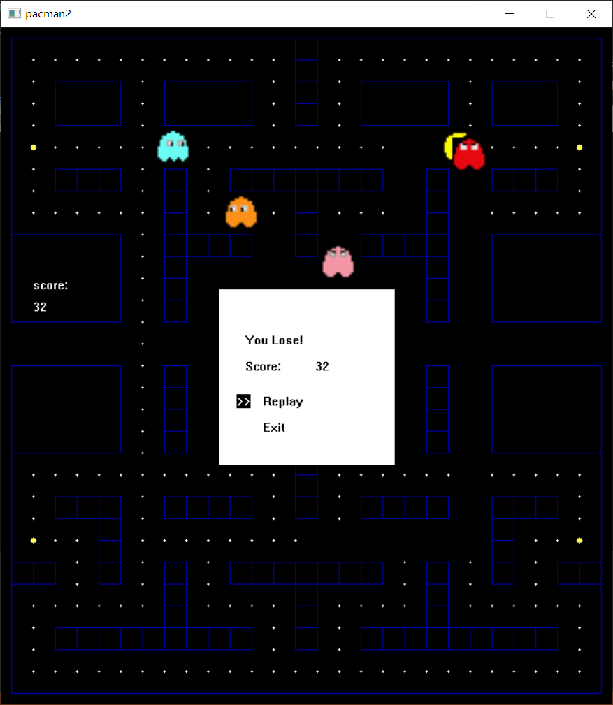
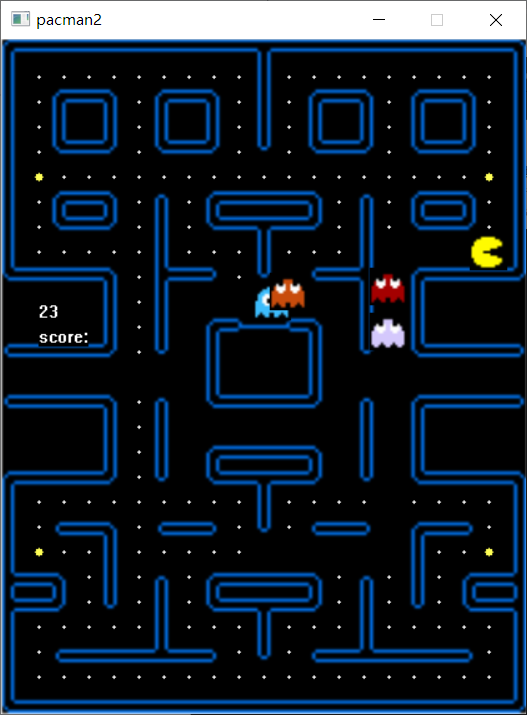
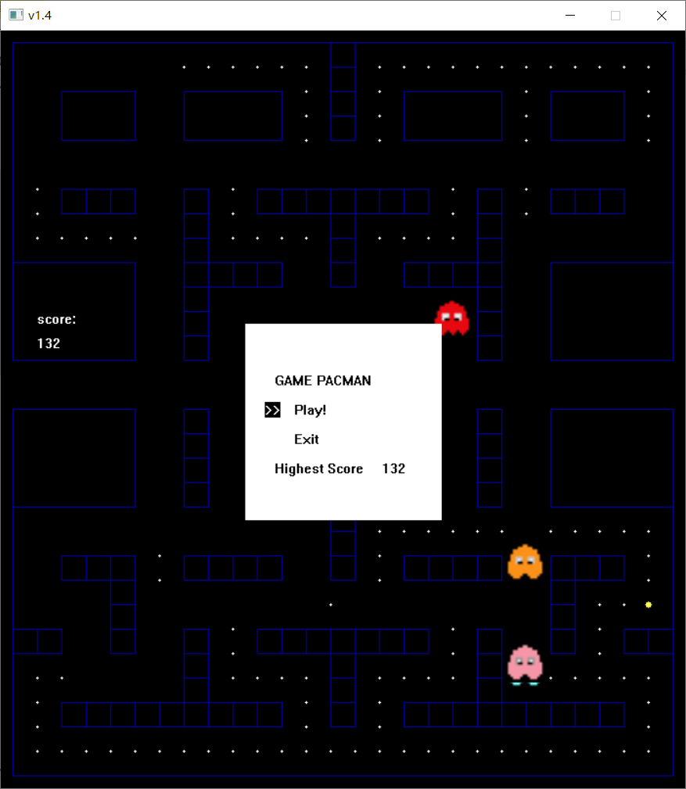
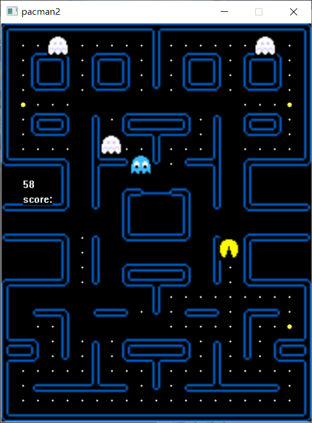
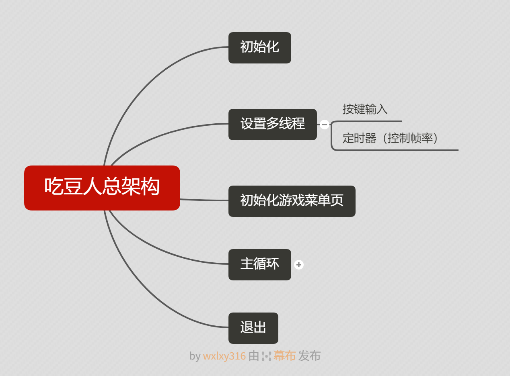
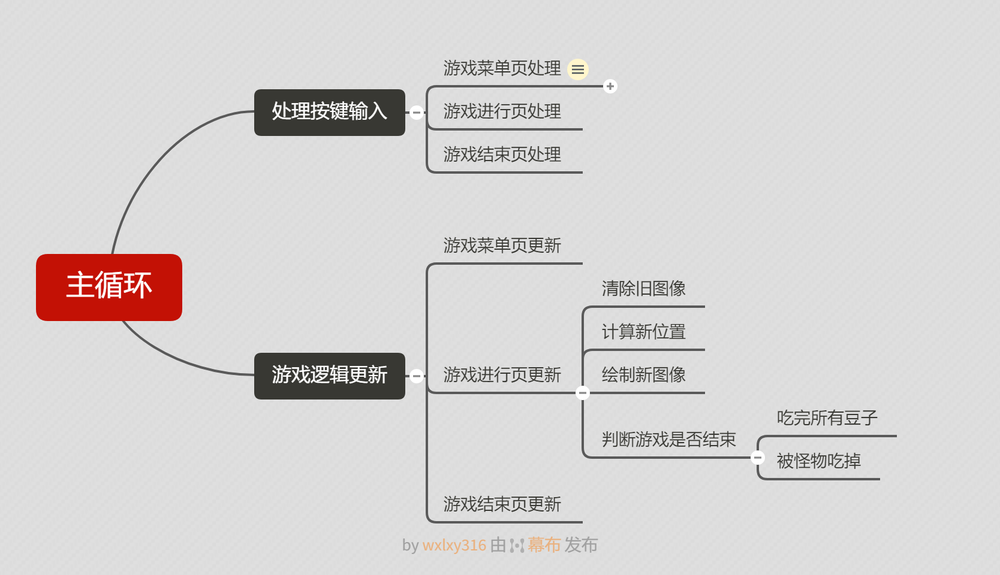
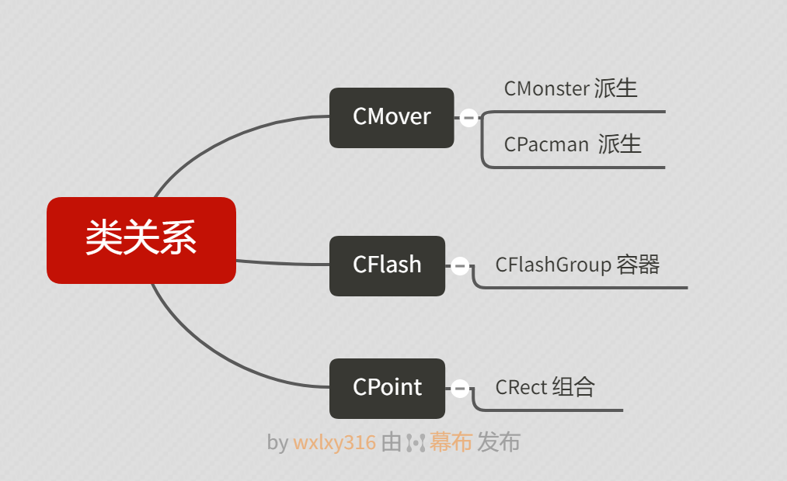

# MyPacman

开发软件：VS2019， Win10

使用的图形库 easyx， 版本2020-1-9，下载地址 https://easyx.cn/

使用的图片素材 /pacman2/res  来自于网络

项目github地址: https://github.com/bridgeL/pacman2

作者 bridgeL

#### 游戏运行画面

#### 吃豆人总架构

- 初始化

- 设置多线程

  - 按键输入
  - 定时器（控制帧率）

- 初始化游戏菜单页

- 主循环

  - 处理按键输入

    - 游戏菜单页处理

      页与页的切换由专门的函数负责，该函数在切换页的同时，处理好新页的初始化问题

      - 页切换函数
        - 游戏菜单页初始化
          - 初始化基本界面
        - 游戏进行页初始化
          - 初始化地图、背景图片、吃豆人、怪物
        - 游戏结束页初始化
          - 初始化基本界面

    - 游戏进行页处理

    - 游戏结束页处理

  - 游戏逻辑更新

    - 游戏菜单页更新
    - 游戏进行页更新
      - 清除旧图像
      - 计算新位置
      - 绘制新图像
      - 判断游戏是否结束
        - 吃完所有豆子
        - 被怪物吃掉
    - 游戏结束页更新

- 退出

#### 类关系

- CMover
  - CMonster 派生
  - CPacman 派生
- CFlash
  
  - CFlashGroup 容器
- CPoint
  
  - CRect 组合
  
  

#### 结构图

#### 文档内容

- mover.h
  - CMover
  - CMonster
  - CPacman
- flash.h
  - CFlash
  - CFlashGroup
- define.h
  - 各类宏定义
  - CPoint
  - CRect 
- astar.h
  - 实现a*寻路算法
- game.h/game.cpp
  - 存放各个游戏页的初始化、处理、更新函数
  - 键盘输入捕获线程
  - 定时器线程（控制帧率）
- app.cpp
  - 游戏主循环

#### A*寻路算法

吃豆人采用传统的A star算法计算路径，参考资料 https://blog.csdn.net/m0_37290785/article/details/93203624

对A star的实现做了一定的优化：

取消close_list，直接使用哈希表存储节点是否关闭，大大提高了A star的计算速度

在初始化节点网络时计算并存储各个节点的距离代价（H值），为后来计算总代价（F值）提供方便

#### 目前的问题

目前仍存在一些问题，比如游戏exe单独打开时帧率较低，甚至达不到30fps，但如果启动VS2019（但不打开任何项目），游戏运行速度就会恢复正常设定的30fps，这里是涉及到了什么dll的运行机制吗？这里笔者存疑

另一个问题在于透明图像的绘制，目前怪物和主角的绘制都是存在黑边的，在重叠时会出现难看而不合理的黑边，目前的一种解决思路是使用掩码，预计会在将来的更新中体现，参考资料 https://blog.csdn.net/Qzwsdaswad/article/details/88540587

还有一些不甚满意的特性存在修改空间：一是怪物恐惧时的躲避动作不够智能，有时会缩在墙角“抖动”（此时是在随机切换方向）；二是吃豆人和怪物的接触判定有些严格；三是四只怪物的追逐模式差异性不大，采用的是调整A*算法中 路径权重和距离权重的比例 的方式实现差异化，希望以后有更好的想法

#### 彩蛋

代码里初始化怪物时，可以删除一行代码，从而显示怪物的追踪路径（用于Debug查看A*的效果）